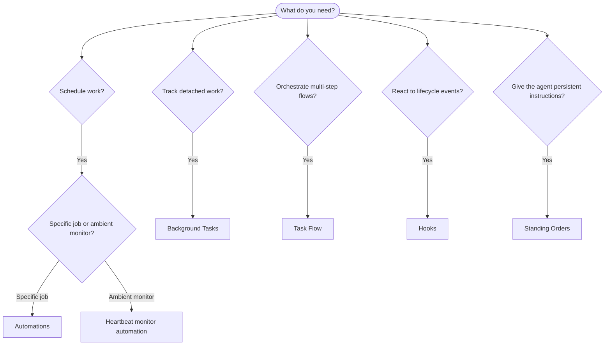

OpenClaw runs work in the background through tasks, scheduled jobs, event hooks,
and standing instructions. Use this page to pick the right mechanism.

## Quick decision guide

| Use case                                  | Recommended                                | Why                                                    |
| ----------------------------------------- | ------------------------------------------ | ------------------------------------------------------ |
| Send daily report at 9 AM sharp           | Automations                                | Exact timing, isolated execution                       |
| Remind me in 20 minutes                   | Automations                                | One-shot with precise timing (`--at`)                  |
| Run weekly deep analysis                  | Automations                                | Standalone task, can use different model               |
| Check inbox every 30 min                  | Automations                                | Independent recurring schedule and job history         |
| Trigger safely on new IMAP email          | IMAP plugin                                | Sender-gated isolated reader sessions                  |
| Monitor calendar for upcoming events      | Automations                                | Explicit recurring schedule and delivery policy        |
| Surface ambient main-session updates      | Heartbeat                                  | System-owned monitor automation and quiet alerts       |
| Inspect status of a subagent or ACP run   | Background Tasks                           | Tasks ledger tracks all detached work                  |
| Audit what ran and when                   | Background Tasks                           | `openclaw tasks list` and `openclaw tasks audit`       |
| Multi-step research then summarize        | Task Flow                                  | Durable orchestration with revision tracking           |
| Run a script on session reset             | Hooks                                      | Internal `HOOK.md` scripts react to lifecycle events   |
| Trigger an agent from an external service | [Webhooks](/automation/cron-jobs#webhooks) | Authenticated HTTP ingress, not an internal event hook |
| Execute code on every tool call           | Plugin hooks                               | Typed `api.on(...)` handlers can intercept tool calls  |
| Always check compliance before replying   | Standing Orders                            | Injected into every session automatically              |

### Automations vs Heartbeat

| Dimension       | User-authored automations                   | Heartbeat monitor automation            |
| --------------- | ------------------------------------------- | --------------------------------------- |
| Timing          | One-shot, interval, or cron expression      | Scheduler-owned interval, default 30min |
| Session context | Isolated, current, named, or main session   | Main session, optionally isolated       |
| Task records    | Created for detached runs                   | Not created for monitor turns           |
| Delivery        | Channel, webhook, or silent                 | Owner-routed alerts or silent           |
| Best for        | Explicit reports, reminders, recurring work | Ambient monitoring and event follow-up  |

Both use the same Automations scheduler. Create an automation for work with its
own instructions or schedule; use heartbeat as the system-owned ambient monitor
when periodic main-session awareness is useful.

## Core concepts

### Automations

Automations are OpenClaw's built-in scheduler for all recurring and one-shot
work, including heartbeat monitors. The scheduler persists jobs, wakes the agent
at the right time, and can deliver output to a chat channel or webhook endpoint.
It supports one-shot reminders, recurring intervals and cron expressions, and
inbound webhook triggers.

See [Automations](/automation/cron-jobs).

### Tasks

The background task ledger tracks all detached work: ACP runs, subagent spawns, isolated automation runs, and CLI operations. Tasks are records, not schedulers. Use `openclaw tasks list` and `openclaw tasks audit` to inspect them.

See [Background Tasks](/automation/tasks).

### Task Flow

Task Flow is the flow orchestration substrate above background tasks. It manages durable multi-step flows with managed and mirrored sync modes, revision tracking, and `openclaw tasks flow list|show|cancel` for inspection.

See [Task Flow](/automation/taskflow).

### Standing orders

Standing orders grant the agent permanent operating authority for defined programs. They live in workspace files (typically `AGENTS.md`) and are injected into every session. Combine with automations for time-based enforcement.

See [Standing Orders](/automation/standing-orders).

### Hooks

Internal hooks are event-driven scripts triggered by agent lifecycle events
(`/new`, `/reset`, `/stop`), session compaction, gateway startup, and message
flow. They are discovered from hook directories and managed with
`openclaw hooks`. For in-process tool-call interception, use
[Plugin hooks](/plugins/hooks).

See [Hooks](/automation/hooks).

### Heartbeat

Heartbeat is a system-owned monitor automation that runs a periodic main-session
turn, every 30 minutes by default. It can use small monitor-scratch context to
surface anything requiring attention without creating a detached task record or
extending session freshness. Create separate automation jobs for work requiring
its own schedule. Empty scratch skips as `empty-heartbeat-file`. Scheduled
monitor turns defer while the main queue or automation work is busy, another run
for the same agent is active, or the target session has active or queued work.

See [Heartbeat](/gateway/heartbeat).

## How they work together

- **Automations** own every recurring schedule, including reports, reminders, and heartbeat monitors. Detached automation runs create task records; main-session runs do not.
- **Heartbeat** is the system-owned ambient monitor automation. Independently scheduled checks belong in their own automation jobs.
- **Hooks** react to specific events (session resets, compaction, message flow) with custom scripts. Plugin hooks cover tool calls.
- **Standing orders** give the agent persistent context and authority boundaries.
- **Task Flow** coordinates multi-step flows above individual tasks.
- **Tasks** automatically track all detached work so you can inspect and audit it.

## Retired inferred commitments

The inferred commitments experiment has been removed: OpenClaw no longer
extracts follow-ups from conversations or delivers them through heartbeat.
The `openclaw commitments` maintenance CLI is also gone. The database migration
discards the old commitment rows and removes their table and indexes.

For reminders or scheduled work, create an explicit
[automation](/automation/cron-jobs). Automations are an alternative with a
schedule and instructions you choose; they do not restore inferred follow-ups.

## Related

- [Automations](/automation/cron-jobs) — precise scheduling and one-shot reminders
- [IMAP email trigger](/automation/imap) — sender-gated inbound email and isolated reader sessions
- [Background Tasks](/automation/tasks) — task ledger for all detached work
- [Task Flow](/automation/taskflow) — durable multi-step flow orchestration
- [Hooks](/automation/hooks) — event-driven lifecycle scripts
- [Plugin hooks](/plugins/hooks) — in-process tool, prompt, message, and lifecycle hooks
- [Standing Orders](/automation/standing-orders) — persistent agent instructions
- [Heartbeat](/gateway/heartbeat) — periodic main-session turns
- [Configuration Reference](/gateway/configuration-reference) — all config keys
