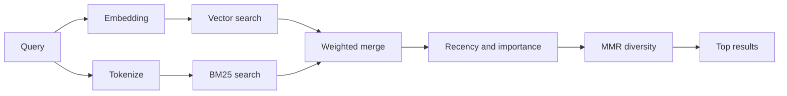

`memory_search` finds relevant notes from your memory files, even when the
wording differs from the original text. It chunks memory into small pieces and
searches them with embeddings, keywords, or both.

## Quick start

OpenClaw uses OpenAI embeddings by default. To use another provider, set it
explicitly:

```json5
{
  memory: {
    search: {
      provider: "openai", // or "gemini", "voyage", "mistral", "bedrock", "local", "ollama", "lmstudio", "github-copilot", "openai-compatible"
    },
  },
}
```

`provider` can also reference a custom `models.providers.<id>` entry (for
example `ollama-5080`), as long as that entry sets `api` to `"ollama"` or
another provider id with a memory embedding adapter.

For local embeddings with no API key, install and configure the official
llama.cpp provider, then set `provider: "local"`:

```bash
openclaw plugins install @openclaw/llama-cpp-provider
```

Choose llama.cpp once in interactive setup. OpenClaw installs a verified
`llama-server`, downloads the embedding GGUF, and writes its managed service
configuration.

Some OpenAI-compatible embedding endpoints require asymmetric `input_type`
labels, such as `"query"` for searches and `"document"`/`"passage"` for indexed
chunks. Set these with `queryInputType` and `documentInputType`; see
[Memory configuration reference](/reference/memory-config#provider-specific-config).

## Supported providers

| Provider          | ID                  | Needs API key | Notes                             |
| ----------------- | ------------------- | ------------- | --------------------------------- |
| Bedrock           | `bedrock`           | No            | Uses the AWS credential chain     |
| DeepInfra         | `deepinfra`         | Yes           | Default model `BAAI/bge-m3`       |
| Gemini            | `gemini`            | Yes           | Supports image/audio indexing     |
| GitHub Copilot    | `github-copilot`    | No            | Uses your Copilot subscription    |
| Local             | `local`             | No            | Managed llama.cpp GGUF, ~0.3 GB   |
| LM Studio         | `lmstudio`          | No            | Local/self-hosted server          |
| Mistral           | `mistral`           | Yes           |                                   |
| Ollama            | `ollama`            | No            | Local/self-hosted server          |
| OpenAI            | `openai`            | Yes           | Default                           |
| OpenAI-compatible | `openai-compatible` | Usually       | Generic `/v1/embeddings` endpoint |
| Voyage            | `voyage`            | Yes           |                                   |

## How search works

OpenClaw runs two retrieval paths in parallel and merges the results:



- **Vector search** matches similar meaning ("gateway host" matches "the
  machine running OpenClaw").
- **BM25 keyword search** matches exact terms (IDs, error strings, config
  keys).
- **Filename search** indexes paths separately from note bodies. Exact full
  paths, basenames, and filename stems rank ahead of partial path matches,
  while snippets and body keyword scores still come from note content.

If only one path is available, the other runs alone.

The builtin engine then applies deterministic ranking:

```text
hybrid relevance × recency decay × importance multiplier
```

Importance is scored once when an entry is written by a memory workflow that
already has a model in the loop. Missing importance is neutral, so existing
indexes keep their previous relevance signal. Dated daily notes decay with a
30-day half-life; curated files such as `MEMORY.md` and `USER.md` are evergreen.
This follows the relevance, recency, and importance result in
[Generative Agents (arXiv:2304.03442)](https://arxiv.org/abs/2304.03442) without
adding a query-time model call.

MMR then reorders the scored hybrid candidate set to reduce redundant
snippets. It does not change scores, threshold eligibility, or make another
provider call.

Search preserves keyword matches when every ranked result falls below the
configured minimum score. Hybrid search can also fill remaining result slots
with keyword-only matches. These rules also apply in project sessions;
semantic-only matches still need to meet the configured minimum score.

## Deterministic trigger recall

On eligible interactive turns, the builtin engine also compares the inbound
message with short trigger phrases stored on indexed entries. Strong matches
can add up to three compact entries to hidden context before the reply. The
prefilter uses the existing keyword and vector retrieval paths and does not run
a recall model.

Automatic injection is deliberately narrower than `memory_search`: only
promoted, trusted entries qualify. Until indexed provenance is available, that
means entries from root `MEMORY.md` and `USER.md` only. Daily notes, imported
transcripts, and session transcripts remain available through explicit memory
tools or Active Memory escalation, but are never injected automatically.

**FTS-only mode.** Set `provider: "none"` to intentionally disable embeddings
and search with keywords only. Leaving `provider` unset or set to `"auto"`
falls back to keyword-only ranking when embedding setup or a request fails, as
does `provider: "local"` (the GGUF/llama.cpp provider). Creation-time fallback
still indexes text for keyword search, including manual and background indexing
before the first search. `memory_search` includes the
redacted embedding-bootstrap reason in `debug.embeddingBootstrap` even when
there are no matches.

**Explicit provider unavailable.** If you name any other provider explicitly
(for example `openai`, `ollama`, `gemini`) and it becomes unavailable at
request time (bad auth, network failure), `memory_search` reports memory as
unavailable instead of silently degrading to FTS-only results. This keeps a
broken configured provider visible. Set `provider: "none"` for deliberate
FTS-only recall, or fix the provider/auth configuration to restore semantic
ranking.

## Improving search quality

Two deterministic ranking passes are enabled by default for hybrid search.

### Recency decay

Old notes gradually lose ranking weight so recent information surfaces first.
With the default 30-day half-life, a note from last month scores at 50% of its
original weight. `MEMORY.md`, `USER.md`, and undated files under `memory/`
remain evergreen. Dated `YYYY-MM-DD.md` and `YYYY-MM-DD-<slug>.md` files decay
at any depth, including session-memory notes and nested dreaming reports.

Session transcript hits use the source activity timestamp captured during
indexing. Retained transcript archives use their indexed file modification
time. Individual message timestamps remain provenance metadata and do not
determine the source's recency weight.

### MMR (diversity)

Reduces redundant results. If five notes all mention the same router config,
MMR favors a similarly relevant result with different content instead of
repeating near-identical snippets. The fixed relevance-biased setting uses
lambda `0.7` with Jaccard overlap over snippet tokens. Its local work is
`O(k²)`: ordinary defaults request 24 candidates per retrieval leg, for at
most 48 unique non-exact candidates before overlap; broader project and
identifier searches remain separately capped.

<Tip>
No configuration is required. FTS-only and vector-only fallback paths do not
run the hybrid MMR pass.
</Tip>

## Multimodal memory

With `gemini-embedding-2`, you can index images and audio alongside
Markdown. This only applies to files under `memory.search.extraPaths`; default
memory roots (`MEMORY.md`, `memory/*.md`) stay Markdown-only. Search queries
remain text, but they match against visual and audio content. See
[Memory configuration reference](/reference/memory-config#multimodal-memory-gemini)
for setup.

## Session memory search

For exact full-text recall from session transcripts, use [`sessions_search`](/concepts/session-search)
and then open a result with `sessions_history`. Session-memory search remains the semantic,
experimental complement.

Optionally index session transcripts so `memory_search` can recall earlier
conversations. This is opt-in: set `experimental.sessionMemory: true` and add
`"sessions"` to `sources` (default `sources` is `["memory"]`).

Use `corpus: "memory"` to search only memory notes. Results containing no session
transcripts do not load session history or perform session-visibility lookups.

Session hits obey `tools.sessions.visibility`, which defaults to `"all"`.
`memory_search` still searches the selected agent's indexed corpus; use
[`sessions_search`](/concepts/session-search) for transcript search across agents
on the Gateway. Visible transcripts can include other users' conversations.
Cross-agent session access is on by default and governed by
`tools.agentToAgent`; set `enabled: false` to block ordinary cross-agent access
(requester-owned native subagent and ACP child sessions stay reachable under `tree` or `all`) or use `allow`
to restrict agent pairs. A per-peer `session.dmScope`
separates DM context but does not restrict transcript access through session
tools. Choose explicit `"agent"` for same-agent recall, `"tree"` for current plus
spawned scope (with an agent-wide exception for main), or `"self"` for strict
current-session recall. Sandbox spawned-only clamps and
incognito exclusions still apply.

## Troubleshooting

**No results?** Run `openclaw memory status` to check the index. If empty, run
`openclaw memory index --force`.

**Only keyword matches?** Your embedding provider may not be configured. Check
`openclaw memory status --deep`.

**Local embeddings time out?** `ollama`, `lmstudio`, and `local` use longer
provider-owned batch deadlines. Run `openclaw memory status --deep` to inspect
the managed server endpoints before rebuilding the index.

**CJK text not found?** Rebuild the FTS index with
`openclaw memory index --force`.

## Related

- [Memory overview](/concepts/memory)
- [Active memory](/concepts/active-memory)
- [Builtin memory engine](/concepts/memory-builtin)
- [Memory configuration reference](/reference/memory-config)
