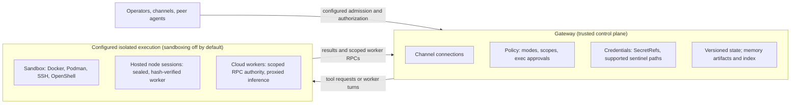
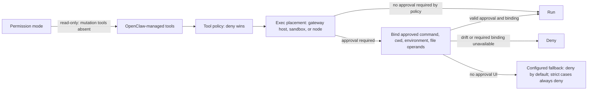
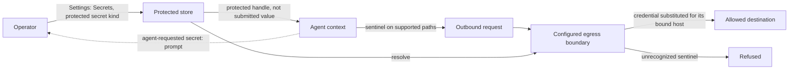

OpenClaw is an extensible, proactive, open-source AI agent that works everywhere you work. It exists because software is inverting: for decades you went to the computer, opened the app, clicked through its screens, and did the work yourself. An agent acts on your behalf instead, on your machine, in your messages, against your accounts.

That inversion is why agents feel like the beginning of something rather than another product cycle, and why they deserve more scrutiny than anything you have installed before: an assistant that acts for you holds credentials, reads mail, and runs commands on real computers. The architecture decides what it _can_ do long before any policy decides what it _may_.

The project is stewarded by the [OpenClaw Foundation](https://openclaw.org), an independent 501(c)(3) whose mission is to make AI personal, fun, and empowering for everyone: your agent, your machine, your rules. It is built on the observation that the open source projects that endure (Linux, Apache, Mozilla) endure because a neutral steward stands behind them.

The Foundation works with [donors and partners](https://openclaw.ai/blog/introducing-openclaw-foundation/), including Atlassian, GitHub, Microsoft, NVIDIA, OpenAI, and Tencent, across more than thirty organizations. It has a full-time team, releases signed under its own identity, and Foundation-convened councils on agent identity, agent profiles, evals, and enterprise deployment. The aim is to be the Switzerland of AI: neutral ground for every model and every lab, and the most mature, battle-tested agent for anyone, individual or enterprise, to build on.

For an evaluation, governance is not decoration. It answers who controls the roadmap, who signs what you deploy, and what happens when any one vendor's incentives change.

Agent platforms commonly offer [channels](/channels), [tools](/tools), [memory](/concepts/memory), [skills](/tools/skills), [scheduling](/automation). A feature table does not establish the security model. The main distinctions are **where the trust boundary lies** and **whether policy is enforced in code or requested in the system prompt**.

A single trust envelope can put the agent loop, channel connections, credentials, and shell under one OS user. Wrapping that entire application in a VM isolates it from the host, but does not separate those components from each other.

The recurring comparison is [Hermes Agent](https://github.com/NousResearch/hermes-agent/tree/6defe7eb6c462bb784d1f27f5afe7ca4b627fc70), whose [security policy](https://github.com/NousResearch/hermes-agent/blob/6defe7eb6c462bb784d1f27f5afe7ca4b627fc70/SECURITY.md) states:

> The only security boundary against an adversarial LLM is the operating system.

OpenClaw can separate a trusted [Gateway](/gateway) from untrusted, movable execution. Policy is enforced in code, and state is versioned and migrated, so a deployment is replaceable. This page compares configured architectures, not default security certifications: sandboxing is off by default in OpenClaw. The source review was refreshed on August 27, 2026 against [OpenClaw `7b624e9de25`](https://github.com/openclaw/openclaw/tree/7b624e9de25bc66c97166071c8d05f055d82ec54) and [Hermes Agent `6defe7eb6c`](https://github.com/NousResearch/hermes-agent/tree/6defe7eb6c462bb784d1f27f5afe7ca4b627fc70). These are development snapshots; check your installed version and configuration before relying on a capability.

A good harness spans the whole range: the same product runs as a personal assistant on one laptop and as a hardened team deployment, with configuration as the only difference. There is no enterprise edition. If you run OpenClaw for yourself, the defaults are tuned for you and none of this requires action. The properties below are phrased as an enterprise evaluation because that is the harshest audience, but every one of them protects a single operator the same way: credentials the agent never sees, deletion that sticks, upgrades that refuse to break state.

## What an enterprise harness has to prove

Seven testable properties:

1. **Separated trust boundary.** Execution moves into a sandbox, a node, or a throwaway cloud machine without standing Gateway credentials; scoped worker credentials have a separate lifecycle.
2. **Policy is code.** Denial is structural, not a request the model is asked to honor; approval paths fail closed.
3. **Authenticated access, bounded roles.** Inbound access is default-deny and authenticated; people hold bounded roles; the vendor states which boundaries are security and which are convenience.
4. **Secrets have owners.** Isolatable credential failures degrade their owners; ingress-auth and invalid-configuration failures stop startup.
5. **Versioned state, guarded upgrades.** State is schema-versioned with owned migrations; upgrades are guarded and delivered through release channels.
6. **Recorded provenance.** Memory, audit, and delivery use recorded facts, explicit retention policies, and documented deletion limits.
7. **Independent stewardship.** The license has no separate enterprise edition; releases are signed by an accountable identity; the security record is public.

## How OpenClaw answers

The short answers, with details and limits in the sections below:

- **Isolation limits what compromised execution can reach.** Configured sandboxes, nodes, and cloud workers separate execution from Gateway authority; exposure still depends on tools, mounts, network policy, and scoped credentials. ([Trust boundary](#the-trust-boundary))
- **Configured policy is enforced in code.** Tool availability and exec denial do not depend only on model compliance; commands requiring approval must satisfy the applicable binding rules. ([Policy as code](#policy-as-code))
- **Access follows the configured admission policy.** Pairing-mode channels challenge unknown senders, and broader device scopes require approval; role ceilings and a deny-all default role require configuration. ([Identity and roles](#identity-and-roles))
- **Protected credentials can stay out of model context.** Protected secret values use handles and supported egress substitution; agent-readable entries, host access, and permitted-service responses have separate exposure risks. ([Secrets](#secrets))
- **Version checks guard upgrades.** Schemas are versioned, updaters check compatibility, and releases are immutable and signed. Version checks do not guarantee that every upgrade succeeds. ([Versioned state](#versioned-state-guarded-upgrades))
- **Forgetting has explicit boundaries.** Attributable memories can be purged, and forgotten-session records prevent reingestion through participating paths; original transcripts, untracked writes, and external copies remain separate. ([Provenance](#provenance))
- **The Foundation provides independent stewardship.** MIT under an independent 501(c)(3) foundation, with signed releases and public security advisories. Advisory counts are not a comparative safety score. ([Governance](#governance))

The [comparison table](#openclaw-and-hermes-agent) condenses the source-verified contrast with Hermes. [What we do not claim](#what-we-do-not-claim) states the limits, starting with sandboxing being off by default.

### The trust boundary

The Gateway owns channel connections, config, credentials, and the [control-plane API](/gateway/protocol). It binds to loopback by default and refuses non-loopback binds without a working auth path ([architecture](/concepts/architecture), [network model](/network)).

[`tools.exec.host`](/tools/exec) resolves to the gateway host, a [sandbox](/gateway/sandboxing), or a paired [node](/nodes). While a sandbox runtime is active, per-call escapes to the host are rejected. An explicit `host=sandbox` with no runtime configured fails instead of silently running on the host. The backends are Docker and Podman, SSH, and [OpenShell](/gateway/openshell). The default Docker and Podman profile has no network, a read-only root, all capabilities dropped, and a non-root user. OpenShell installs as a plugin and registers through the same backend contract as Docker. If you run OpenShell already, OpenClaw uses its sandboxes. It does not need to be wrapped in one.

Sandbox bind mounts are validated twice, once on the normalized path and again after resolving through the deepest existing ancestor, so symlink-based bypass attempts fail closed. The deny-list of credential and system paths cannot be disabled — the `dangerouslyAllowExternalBindSources` override relaxes only the allowed-roots check.

This separation also applies across machines. A paired [node](/nodes) that hosts sessions receives a sealed worker artifact. OpenClaw verifies that artifact's content hash at three points: download, manifest, and every reuse. The node installs no packages and runs no lifecycle scripts. It can also put each hosted session in its own container, enforced by node-local config the Gateway's launch request cannot express.

With [Cloud workers](/gateway/cloud-workers), a session's coding work runs on a throwaway cloud machine. That machine connects back to the Gateway with a closed, dispatcher-enforced RPC method allowlist. It gets per-dispatch minted credentials, stored hashed at rest with a ten-minute TTL, and holds no standing model, GitHub, or cloud credential. Inference is proxied through the Gateway. The [durable transcript](/concepts/session) lives only on the Gateway. The worker sees a bounded per-turn context window and does not persist a local transcript copy.

A remote tool backend also changes what sandboxed code can reach. Hermes can move terminal, file, and Python `execute_code` work to a configured backend while its parent process handles tool RPCs ([execution source](https://github.com/NousResearch/hermes-agent/blob/6defe7eb6c462bb784d1f27f5afe7ca4b627fc70/tools/code_execution_tool.py#L1078)). OpenClaw's cloud-worker design additionally gives worker turns a Gateway-owned lifecycle, scoped RPC authority, proxied inference, and Gateway-owned durable transcripts. In either design, reachable credentials and services depend on the enabled tools, mounts, network policy, and backend configuration.

**Sandboxing is off by default.** Out of the box, OpenClaw is a personal assistant for one trusted operator, and exec runs on the gateway host without prompts. The enterprise posture requires explicit configuration, verifiable with two commands: [`openclaw sandbox explain`](/gateway/sandbox-vs-tool-policy-vs-elevated) prints the effective execution posture, and [`openclaw security audit`](/gateway/security/audit-checks) flags drift with stable check IDs you can alarm on.

### Policy as code

Deterministic enforcement is not unique to OpenClaw — Claude Code, Codex, and Goose all gate approvals in code. Structural tool gating in a multi-channel assistant, rather than a terminal, is rarer: [permission modes](/gateway/permission-modes) shape which tools exist at all. For OpenClaw-managed tools, a `read-only` session omits `edit`, `write`, and `apply_patch`, and its exec tool resolves to a deny policy at the call boundary. Native harnesses can retain their own tool surface and apply native permission controls separately ([Codex runtime policy](/plugins/codex-harness-runtime)). `full` requires `operator.admin`, and scopes are derived from request parameters before dispatch ([operator scopes](/gateway/operator-scopes)), so a method with a privileged parameter still needs the privileged scope.

Three controls govern separate decisions ([sandbox vs. tool policy vs. elevated](/gateway/sandbox-vs-tool-policy-vs-elevated)). The sandbox decides where tools run. Tool policy decides which tools exist; deny always wins. Routine policy-filter diagnostics name the configured layer and matched deny entries at debug level; the [durable audit ledger](/gateway/audit) records blocked outcomes separately, without the matched rule. `tools.elevated` is an exec-only escape hatch that cannot override a deny.

[Exec approvals](/tools/exec-approvals) bind an approved run to its canonical command, cwd, environment hash, and content-hashed file operands, and deny on any drift after approval. Supported pipelines and command chains can use enforced execution plans. Shell forms or interpreter invocations for which OpenClaw cannot establish the required execution and file bindings are refused. When no approval UI is reachable, the answer is deny by default, and strict cases (inline eval, heredocs) cannot be softened by any fallback setting.

Tool policy filters by name, not side effects: allowing `exec` while denying `write` does not make shell commands read-only. As documented, restricting side effects is the sandbox's responsibility.

### Identity and roles

Device-authenticated control-plane clients present signed identities and go through [pairing](/gateway/pairing). Reconnecting with broader device scopes requires approval. Other admission paths include verified front doors and configured local or shared-secret access. With DM policy set to [pairing](/channels/pairing), unknown senders get a pairing code, not the agent. Identity-aware front doors ([Tailscale](/gateway/tailscale), [trusted proxy](/gateway/trusted-proxy-auth), [Cloudflare Access](/gateway/cloudflare-access)) map verified identities to scopes.

Eight [operator scopes](/gateway/operator-scopes) — `read`, `write`, `admin`, plus narrower ones for pairing, approvals, questions, and talk — are derived per request from the actual parameters before dispatch, and methods with no scope classification are denied rather than allowed. Write and admin operations require their corresponding scopes. [`gateway.roles`](/gateway/operator-scopes) assigns named person-level roles: visibility into other people's sessions, an agent allow-list, and a scope ceiling that is intersected with whatever connection auth granted, never added to it. Profiles without a valid assignment receive the configured default role; configure that role as deny-all for a hardened deployment. Omitting `gateway.roles` leaves the role boundary disabled. [Multi-user sessions](/concepts/multi-user) record an immutable creator, an assignable owner, and a bounded participant history, and verified GitHub identity can flow through to `Co-authored-by` trailers and PR-linked session transcripts ([user model](/concepts/user-model)).

Our [security docs](/gateway/security) define the scope: one gateway is one trust domain. Roles organize collaboration between people who already trust each other. For tenancy, you run one gateway per tenant; [`openclaw fleet`](/cli/fleet) automates this with one hardened container cell per tenant with its own state, credentials, and network (currently experimental), and the [multi-tenant guide](/gateway/multi-tenant-hosting) documents the isolation ladder above it, through gVisor and Kata up to separate machines.

### Secrets

Every supported credential field takes a [SecretRef](/gateway/secrets): `env`, `file`, `exec` (this is how 1Password, Vault, Bitwarden, and sops plug in), or the shared store. Retryable resolution failures for mapped, isolatable owners let the Gateway start degraded. The exact owner (one provider, one channel account, one plugin route) is marked unavailable, requests to it fail with a typed error, nothing falls back to a different credential, and [`doctor`](/cli/doctor) and `status` name every degraded owner with a redacted reason. Gateway ingress-auth failures, unknown ownership, and invalid secret configuration still prevent startup.

Model-provider credentials use sentinels on supported egress paths: the real value is substituted at the egress boundary, and an unrecognized sentinel-shaped value is refused rather than forwarded. An operator can supply a credential without exposing its value to the agent by choosing the protected **secret** kind under **Settings → Secrets** in the [Control UI](/web/control-ui). Protected values are omitted from agent-facing reads; a separate admin-scoped resolve exists for operators. Agent-readable environment entries are a different kind. The opt-in [egress proxy](/gateway/secrets) substitutes protected sentinels only for their bound destination hosts. Exfiltrating the encrypted sentinel alone does not reveal the underlying credential outside the Gateway process, but this does not protect other private context or prevent misuse of an authorized service. A permitted service can also reflect credentials back to the agent, so destination trust and host isolation still matter. An [agent-requested secret](/tools/secrets) prompt uses the same protected store without putting the submitted value in the conversation.

Hermes supports environment- and vault-backed credentials, [context-local secret resolution for multiplexed profiles](https://github.com/NousResearch/hermes-agent/blob/6defe7eb6c462bb784d1f27f5afe7ca4b627fc70/agent/secret_scope.py), and an optional [iron-proxy integration](https://github.com/NousResearch/hermes-agent/blob/6defe7eb6c462bb784d1f27f5afe7ca4b627fc70/website/docs/user-guide/egress/iron-proxy.md) that supplies Docker tools with opaque provider tokens while a host-side proxy injects credentials. These are real protections with different custody and bypass limits; neither project's proxy is a substitute for process and network isolation. In OpenClaw, [`secrets audit`](/cli/secrets) finds plaintext at rest and `secrets configure --apply` moves supported fields behind refs. Workspace `.env` files cannot override provider keys or `OPENCLAW_*` runtime controls.

OpenClaw provides agent-requested credentials as an integrated Gateway flow: the operator submits the value through a protected surface and the agent receives a reusable handle. This is not a unique pattern. MCP supports [out-of-band URL elicitation for sensitive data](https://modelcontextprotocol.io/specification/2025-11-25/client/elicitation#url-mode-elicitation-for-sensitive-data), including credentials stored by a server for later use; it forbids requesting secrets through form-mode elicitation. Hermes also supports operator-configured vault resolution. These mechanisms differ in integration and custody, not in whether a credential can ever stay out of model context.

The store itself is `0600`-permission SQLite, not an HSM, and the docs direct operators with stronger custody requirements to external vaults. A SecretRef removes inline credentials from the referring configuration; storage exposure depends on the selected provider. It does not stop a host-exec agent from reading files. Restricting file access is the sandbox's responsibility.

### Versioned state, guarded upgrades

Runtime state is database-first: one global SQLite store, one per agent, with a written contract that runtime code never reads or writes JSON sidecars as active state. The contract is machine-checked in CI ([database schemas](/reference/database-schemas)). Schemas carry a two-place version contract; a build refuses to open a database newer than itself. [`openclaw update`](/cli/update) refuses targets whose declared schema support is older than your on-disk databases; legacy target packages without schema metadata cannot be preflighted. [`openclaw doctor --fix`](/cli/doctor) is the single owner of file-to-SQLite migrations and records a receipt for each one. SQLite snapshots in [backups](/cli/backup) use SQLite's online-backup API and are integrity- and hash-checked during creation and publication. Whole-archive verification does not bind ordinary file payloads to content hashes; restore never happens in place. [Restart recovery](/gateway/restart-recovery) resumes interrupted turns under a bounded attempt budget, and a crash-loop breaker keeps the control plane reachable while suppressing channel autostart.

Releases come through four channels (stable, extended-stable, beta, dev) on calendar versions with immutable npm publishes ([development channels](/install/development-channels), [release process](/reference/RELEASING)). Extended-stable is the conservative track and it fails closed: the updater re-fetches and verifies the exact selected package, and missing or inconsistent registry data is an error, never a fallback to `latest`. The [Full Release Validation](/reference/full-release-validation) workflow seals an immutable execution-plan artifact covering cross-OS installs and upgrades, package acceptance, live channel lanes, and performance gates. Publishing is serialized and provenance-verified (Sigstore attestations, npm provenance) under the OpenClaw Foundation identity.

Per-surface readiness is published. The [maturity scorecard](/maturity/scorecard) grades 50 surfaces across [280 capability areas](/maturity/taxonomy) from deterministic QA evidence plus reviewed quality scores, with long-term-support status on every row. Extended-stable answers how long a surface is supported; the scorecard answers how proven it is.

### Provenance

The default OpenClaw memory backend keeps Markdown artifacts plus a SQLite index and metadata ([memory architecture](/concepts/memory-architecture)). Each indexed chunk carries an origin class (`owner`, `agent`, `untrusted`, `system`) stored outside the prose. Recalled text therefore cannot promote its own trust level, and classification never defaults to `owner`. Graph memory layers like Zep's Graphiti also trace facts to their sources. What OpenClaw adds is a gate that consumes the provenance. The [dreaming](/concepts/dreaming) consolidation pass drops `untrusted` and `system` candidates before the consolidation prompt is even built. Automatic session ingestion excludes [cron](/automation/cron-jobs), [heartbeat](/gateway/heartbeat), and [subagent](/tools/subagents) sessions. These exclusions do not prevent direct file writes by tools with the required access. Taint follows content within a turn, too. After a network-sourced tool result, every later assistant message in that turn is marked tainted and classifies `untrusted` for memory, whoever was speaking. Cross-conversation recall has a fixed boundary: groups and channels are neither source nor destination ([active memory](/concepts/active-memory)).

Related research provides context, not validation of OpenClaw's implementation. [Generative Agents](https://arxiv.org/abs/2304.03442) explores relevance, recency, and importance in retrieval. [MMR](https://dl.acm.org/doi/10.1145/290941.291025) balances relevance and diversity. [Sleep-time compute](https://arxiv.org/abs/2504.13171) studies useful precomputation before a query. [LongMemEval](https://arxiv.org/html/2410.10813v2) shows that retained detail, indexing, retrieval, and reading strategy all affect long-term recall. Memory-poisoning work such as [MINJA](https://arxiv.org/abs/2503.03704) and [OWASP ASI06](https://genai.owasp.org/2025/12/09/owasp-top-10-for-agentic-applications-the-benchmark-for-agentic-security-in-the-age-of-autonomous-ai/) motivates careful trust boundaries. Provenance-gated promotion does not establish immunity to every poisoning attack. [TriggerBench](https://arxiv.org/abs/2606.23459) studies prospective memory, a problem OpenClaw also addresses with explicit [standing intents](/concepts/standing-intents).

Deletion needs a separate distinction. [Ghost Vectors](https://arxiv.org/abs/2606.18497) examines recovery from soft-deleted vector storage. Forgotten-session records prevent reingestion through participating OpenClaw paths. They do not establish physical or cryptographic erasure of underlying storage.

Entries tracked by automatic session ingestion and backfill keep their origin sessions through consolidation. Origins union on merge and re-key on supersede, and the model never carries provenance itself. An [admission policy](/reference/memory-config) keeps designated sessions out of dreaming ingestion and session backfill with recorded, reversible exclusions. [`openclaw memory forget`](/cli/memory) purges attributable entries, exact diary quotations, index rows, vectors, embedding caches, and rewrite backups. It then blocks reingestion of the selected sessions with durable forgotten-session records. A participant selector selects whole sessions involving that participant, not only their messages. Direct edits, untracked memories and paraphrases, original transcripts, other agents' stores, exports, and external copies require separate review. Neither admission nor forgetting is a general erasure guarantee ([deletion boundaries](/concepts/memory-provenance#what-deletion-does-not-cover)).

Forgotten-session records protect a specific boundary: OpenClaw's participating ingestion, backfill, and indexing paths do not restore data from those session IDs in that agent's store. They do not prevent a later conversation, direct file write, or another memory plugin from introducing the same information. Provenance and deletion should be evaluated against those documented boundaries, not treated as proof of universal non-resurrection or regulatory compliance.

The [audit ledger](/gateway/audit) stores identity, ordering, action, and outcome codes. It never stores prompts, bodies, arguments, or filenames. Queries enforce a 30-day retention cutoff with row caps, and physical pruning is batched. Decision receipts use a closed vocabulary where `enforced` marks decisions from a gate that actually governed the action. A bare success is never upgraded into authorization proof. The docs publish their own non-claims, including "absence of a row proves nothing" and pseudonymization being correlation rather than anonymization. [OpenTelemetry](/gateway/opentelemetry) can export operational diagnostics to your SIEM, but bounded queues, sampling, shutdown, and exporter failures can lose data. Neither surface promises a lossless compliance archive.

Participating channel ingress queues retain events that exhaust their retry policy in an inspectable, resubmittable [dead-letter queue](/cli/channels). This does not cover every inbound path: IMAP triggers dispatch through a separate hook path without channel dead-letter resubmission. Outbound messages carry staged terminal states. The design goal is a visible outcome or a recorded, intentional non-outcome for every action. The audit coverage and loss limits above still apply.

Independent verification exists at three levels. There is a community [threat model mapped to MITRE ATLAS](/security/THREAT-MODEL-ATLAS). There are [TLA+ models](/security/formal-verification) of the riskiest authorization and isolation paths. Those are models of the design, checked in bounded state spaces, and they do not establish that "the TypeScript is verified", as the docs state. There is also a public [maturity scorecard](/maturity/scorecard) that grades our coverage.

## The vendor's harness, as a plugin

Agent harnesses are becoming model-specific: labs train and evaluate their models inside their own loops. OpenClaw treats those harnesses as first-class runtimes rather than API endpoints ([agent runtimes](/concepts/agent-runtimes)). The [Codex plugin](/plugins/codex-harness) drives Codex's own app-server loop — native thread resume, compaction, approvals, mid-turn steering, OpenClaw tools bridged into Codex turns, [computer use](/plugins/codex-computer-use) — the Copilot plugin runs the GitHub Copilot SDK's session loop, and the Anthropic plugin drives the installed Claude Code executable through its structured stdio protocol, while OpenClaw keeps ownership of channels, sessions, policy, and state. The choice stays with the operator, subject to supported routes, authentication, and request settings. [Runtime selection](/concepts/agent-runtimes#runtime-selection) can use a declared fallback to OpenClaw's built-in loop; inspect the completed runtime when exact harness ownership matters. Gateways that integrate these vendors at the API layer keep their own executor in charge; the vendor harness is at most an optional backend.

This embedding pattern comes from the vendors. OpenAI built the Codex app-server so partners could "embed the same harness in their own products" ([Unlocking the Codex harness](https://openai.com/index/unlocking-the-codex-harness/)) and [described its open-source harness and platform integrations](https://developers.openai.com/blog/codex-as-a-platform) in August 2026; Anthropic ships the [Claude Agent SDK](https://anthropic.com/engineering/building-agents-with-the-claude-agent-sdk) as the same harness that powers Claude Code. The relevant comparison is which native lifecycle and tool contracts an integration preserves, not whether it merely names the vendor's model.

Like other OpenClaw features, harnesses ship as plugins against a core that stays deliberately small. Channels, model providers, memory, voice, the Codex harness — all plugins behind documented [capability registration points](/plugins/architecture), with the boundary enforced by CI import guards, not convention. You can remove what you do not want (strip channels, disable memory, run a minimal surface, pin the allowed set with `plugins.allow`), and third parties can add what we did not build through the same [SDK contracts](/plugins/sdk-channel-plugins) — including whole message channels, which is how community plugins cover networks the core never touches. The ordinary plugin loader validates [manifests](/plugins/manifest) before importing plugin runtime code. Trusted bundled helpers can load separately after path validation.

The public plugin SDK publishes about 150 entrypoints, held under shrink-only surface budgets so growth is a conscious decision. Hermes also has a broad [Python plugin API](https://github.com/NousResearch/hermes-agent/blob/6defe7eb6c462bb784d1f27f5afe7ca4b627fc70/hermes_cli/plugins.py), including tools, platforms, context engines, memory, secret sources, and media providers, plus a [desktop plugin SDK](https://github.com/NousResearch/hermes-agent/blob/6defe7eb6c462bb784d1f27f5afe7ca4b627fc70/website/docs/developer-guide/desktop-plugin-sdk.md). Its seven consent capability IDs describe permission gates, not the size of that API.

[ClawHub](/clawhub) is OpenClaw's registry, with [publishing](/clawhub/publishing), moderation, [security audits](/clawhub/security-audits), and per-release trust verdicts consumed during installation. Hermes also distributes skills through tap repositories and maintains an MCP catalog. ClawHub shows skill scan status from VirusTotal, ClawScan, and static analysis, but a pending or stale scan can allow installation with a warning; installation is not proof that every scan completed. [`openclaw skills verify`](/cli/skills) retrieves ClawHub's verification envelope for the selected skill, using installed registry and version metadata by default; it does not hash current local files.

## Open standards

OpenClaw adopts the protocols the ecosystem is converging on. It is an [MCP client](/tools/mcp) (Streamable HTTP, SSE, and stdio transports, with OAuth) and an [MCP server](/cli/mcp), and plugins can [ship their own MCP servers and apps](/plugins/manifest#mcp-server-reference). Other agents reach it through the Linux Foundation [A2A 1.0 protocol](/channels/a2a) — Agent Card discovery, authenticated JSON-RPC tasks, and outbound peer messaging — and editors connect over the [Agent Client Protocol](/cli/acp), which OpenClaw also uses to [host external harnesses](/tools/acp-agents). Agents render live [A2UI widgets](/web/dashboards) on session dashboards.

Skills follow the [AgentSkills spec](/tools/skills), plugin installs auto-detect [Agent Plugins, Codex, Claude, and Cursor bundle layouts](/plugins/bundles), and the Gateway can serve an [OpenAI-compatible API](/gateway/openai-http-api) (`/v1/chat/completions` with a documented function-tool subset, [`/v1/responses`](/gateway/openresponses-http-api), `/v1/models`, `/v1/embeddings`; disabled by default, `/v1/responses` separately enabled) so OpenAI clients can target the Gateway directly. Observability exports over [OpenTelemetry](/gateway/opentelemetry) and [Prometheus](/gateway/prometheus); gateways advertise via [Bonjour and DNS-SD](/gateway/bonjour); channels include native [Matrix](/channels/matrix), [IRC](/channels/irc), and [Nostr](/channels/nostr) protocol implementations; and releases ship with [npm provenance and verifiable artifact attestations](/reference/RELEASING).

## Working together

Most agent-assisted work today happens between one person and one terminal; others see the finished commits. A shared OpenClaw gateway makes the work itself observable. [Sessions](/concepts/session) carry an immutable creator, an assignable owner, and the people who actually prompted; the [Control UI](/web/control-ui) shows [who is viewing and typing](/concepts/presence) in real time (drafts stay ephemeral and never reach the model or the transcript), and the sidebar filters by owner or by "involving me" ([multi-user](/concepts/multi-user)). A conversation that starts in a channel can continue as a session the whole team can open, steer, and take over.

OpenClaw supplies exact `Co-authored-by` trailers for eligible shared-session participants with verified GitHub identity and **Git co-author credit** enabled, ordered by recorded contribution aggregates. Credit is on by default for verified accounts and can be disabled in Profile. The Gateway publication broker enforces that credit in its generated commits and pull requests; ordinary Git relies on agent instructions and post-commit verification. When an external HTTPS session URL is available, broker-created pull requests end with a link to the team session ([user model](/concepts/user-model)), so a reviewer with access can read the conversation that produced the diff. Local coding sessions can be mirrored near-live to a team gateway with [Beam](/plugins/beam), and [cloud workers](/gateway/cloud-workers) put execution on disposable machines while the transcript stays in one shared place. [Portals](/gateway/portals) proxy an agent's development server into the operator's browser through the Gateway, and Cloud Worker Desktop streams a live VNC view of the worker — an authenticated loopback-only RFB server, reached through a single-use broker ticket over the worker's own outbound connection, never public ingress, with view-only filtering and single-controller arbitration. Hermes also provides visual observation: its desktop app [forwards remote development servers over SSH](https://github.com/NousResearch/hermes-agent/blob/6defe7eb6c462bb784d1f27f5afe7ca4b627fc70/apps/desktop/electron/preview-reach.ts), and its [Camofox integration can expose a browser VNC viewer](https://github.com/NousResearch/hermes-agent/blob/6defe7eb6c462bb784d1f27f5afe7ca4b627fc70/tools/browser_camofox.py#L154). Those are different transports and scopes from OpenClaw's Gateway-brokered worker desktop. OpenClaw is developed in shared sessions on the maintainers' own team gateway; the roles, attribution, and audit surfaces above support that workflow. To set this up for your own team, follow [Team setup](/start/teams).

## Governance

The whole OpenClaw product is MIT-licensed, with no enterprise edition under a different license, and it is governed by the [OpenClaw Foundation](https://openclaw.org) introduced above. The Foundation's stewardship shows up in the architecture: providers are plugins, and no lab's model is privileged. Releases are signed and published under the Foundation identity.

Hermes is built by Nous Research, a venture-funded company listed in [Paradigm's portfolio](https://www.paradigm.xyz/portfolio). This is a difference in governance and funding, not a judgment of the engineering or a security guarantee for either project.

Third parties invest in the architecture: NVIDIA's [NemoClaw](https://nvidianews.nvidia.com/news/nvidia-announces-nemoclaw) distribution hardens OpenClaw with OpenShell kernel-level sandboxing, infrastructure vendors publish [production-hardening guides](https://nebius.com/blog/posts/openclaw-security) for it, and [academic security case studies](https://arxiv.org/html/2603.12644v1) analyze the architecture and catalog threats. Those publications describe their own dated snapshots, not certification of today's configuration.

OpenClaw [publishes repository security advisories](https://github.com/openclaw/openclaw/security/advisories), with a written [trust model](/gateway/security), an [incident response plan](/security/incident-response), and security contributors from NVIDIA and Tencent. On August 27, 2026, the public repository advisory lists contained 647 OpenClaw advisories and [no Hermes advisories](https://github.com/NousResearch/hermes-agent/security/advisories). Hermes has CVEs published through third-party CNAs. These counts describe disclosure records, not the number of currently exploitable defects or a comparative safety score.

## What we do not claim

- Sandboxing and exec approvals are off by default. Default OpenClaw is a trusted single-operator assistant. Hardening is deliberate configuration, and `openclaw security audit` will tell you when you have drifted from it.
- One gateway is one trust domain. Roles and session ownership are collaboration guardrails. Tenancy means one gateway cell per tenant, and fleet is still experimental.
- Native plugins run in-process and are not sandboxed. Mitigations are allow-lists, an install-policy hook, pinned versions, dependency locking, and CI-enforced SDK boundaries. Both OpenClaw and Hermes require trust in installed native plugins.
- Egress allowlisting covers cooperating traffic only. The [secret egress proxy](/gateway/secrets) gained an opt-in traffic allowlist for Gateway-hosted exec (August 2026) on top of its bypass-surviving sentinels, sandboxed execution defaults to kernel-enforced `network: "none"` or runs under the [OpenShell backend's](/gateway/openshell) default-deny policy allowlists, but raw sockets from unsandboxed host exec answer to an operator-supplied [proxy](/security/network-proxy) or host policy, not to OpenClaw. Allowlist proxies elsewhere have had published bypasses; the sentinel design assumes bypass instead of trying to prevent it.
- Promoted memories have no time-based retention bound. Provenance and [`openclaw memory forget`](/cli/memory) cover tracked artifacts; admission exclusions apply to dreaming ingestion and session backfill, not direct writes, hooks, or raw transcript indexing. Review [deletion limits](/concepts/memory-provenance#what-deletion-does-not-cover) separately. Turn taint covers network-sourced tool output; text arriving through non-network tools does not taint the turn.
- `gateway.roles` is present in the reviewed August 2026 source snapshot. Check your installed version before depending on it.

## OpenClaw and Hermes Agent

Hermes Agent (Nous Research, MIT) is a personal-agent platform with a CLI, messaging gateway, desktop app, and plugin system. The comparison below reflects source at [`6defe7eb6c`](https://github.com/NousResearch/hermes-agent/tree/6defe7eb6c462bb784d1f27f5afe7ca4b627fc70) (reviewed August 27, 2026), not a live adversarial test or a guarantee about every deployment.

**Source findings.** Hermes's [`security policy`](https://github.com/NousResearch/hermes-agent/blob/6defe7eb6c462bb784d1f27f5afe7ca4b627fc70/SECURITY.md) treats authorized callers within an adapter as equally trusted; their configured tools can include shell access. Its [command guards](https://github.com/NousResearch/hermes-agent/blob/6defe7eb6c462bb784d1f27f5afe7ca4b627fc70/tools/approval.py#L4564) include hardline and configured deny rules before smart review on host-reaching backends. Cron and single-query contexts default to denying commands that require approval, while other non-interactive contexts can still auto-approve. Its [Codex adapter](https://github.com/NousResearch/hermes-agent/blob/6defe7eb6c462bb784d1f27f5afe7ca4b627fc70/agent/transports/codex_app_server_session.py) reuses a thread within a running agent and supports steering, but starts a new native thread after process restart; user turn input is text-only. A [curated MCP bridge](https://github.com/NousResearch/hermes-agent/blob/6defe7eb6c462bb784d1f27f5afe7ca4b627fc70/agent/transports/hermes_tools_mcp_server.py) exposes Hermes tools to Codex, excluding tools that require the running Hermes agent-loop context.

**Historical reports.** A [user-posted static-analysis audit of Hermes v0.8.0](https://github.com/NousResearch/hermes-agent/issues/7826) classified four findings as critical and nine as high; those are the reporter's classifications, not verified current-head vulnerability counts. The cited [updater failure](https://github.com/NousResearch/hermes-agent/issues/32384) and [gateway memory leak](https://github.com/NousResearch/hermes-agent/issues/25315) were closed with maintainer comments recording fixes. Third-party CNA records, including [CVE-2026-14625](https://nvd.nist.gov/vuln/detail/CVE-2026-14625), report vendor non-response; that statement is the CNA's account, not an independent finding of this review.

Hermes's [built-in memory store](https://github.com/NousResearch/hermes-agent/blob/6defe7eb6c462bb784d1f27f5afe7ca4b627fc70/tools/memory_tool.py) removes entries without source-session tombstones. A later write can add the same fact again; this is a limitation inferred from the store contract, not a reproduced model-driven resurrection. Autonomous memory writes are enabled by default, with an optional approval gate. Hermes also provides atomic credential writes, import-frozen redaction, child-environment scrubbing, and session attribution in its SQLite store.

Both projects support many [model providers](/providers) and [channels](/channels). Counts are not directly comparable: catalogs mix vendors, authentication routes, transports, and plugin distribution types. OpenClaw's catalog includes Nextcloud Talk, generic Nostr, Twitch, Urbit, and three Zalo connection paths; Hermes's Nostr integration is Buzz-specific and supports self-hosted relays. Check the current catalogs for the exact integration and maintenance model you need.

**Integration choices.** Hermes includes SimpleX, ntfy, and conversational email adapters (IMAP polling, threaded SMTP replies), plus Home Assistant state-change subscriptions. OpenClaw handles email as automation: the bundled [IMAP trigger](/automation/imap) routes authenticated inbound mail into an isolated session using the selected reader agent's tool policy. The documented setup configures a restricted reader; isolation alone does not restrict its tools. [Gmail push](/automation/cron-jobs#gmail-pubsub-integration) provides a separate Gmail automation path, with sending through skills. Hermes's [email adapter](https://github.com/NousResearch/hermes-agent/blob/6defe7eb6c462bb784d1f27f5afe7ca4b627fc70/plugins/platforms/email/adapter.py#L1028) checks sender authorization and authentication by default, then routes messages into per-sender conversations with the configured core toolset. Both projects support third-party integrations; evaluate the adapter, its defaults, and who maintains it rather than inferring completeness from a feature count.

Hermes also has [opt-in session pruning](https://github.com/NousResearch/hermes-agent/blob/6defe7eb6c462bb784d1f27f5afe7ca4b627fc70/hermes_cli/config_defaults.py#L3256) and [OTLP gateway monitoring export](https://github.com/NousResearch/hermes-agent/blob/6defe7eb6c462bb784d1f27f5afe7ca4b627fc70/agent/monitoring/otlp_exporter.py), separate from its Langfuse tracing. Its [updater](https://github.com/NousResearch/hermes-agent/blob/6defe7eb6c462bb784d1f27f5afe7ca4b627fc70/hermes_cli/update_cmd.py#L8000) fast-forwards a selected Git branch and can roll back when critical-file syntax checks fail. These controls should not be omitted when comparing OpenClaw's release channels and audit architecture.

| Property             | OpenClaw                                                                                                                    | Hermes Agent (`6defe7eb6c`)                                                                                                                                                            |
| -------------------- | --------------------------------------------------------------------------------------------------------------------------- | -------------------------------------------------------------------------------------------------------------------------------------------------------------------------------------- |
| Trust boundary       | Gateway-owned authority; configured sandbox, node, or cloud-worker execution; sandboxing off by default                     | Parent-owned tool dispatch; terminal, file, and generated-Python work can use remote backends                                                                                          |
| Policy gate          | Structural tool policy and deterministic denial; optional review and approval layers                                        | Smart review of flagged commands behind hardline/configured denials on host-reaching backends; cron and one-shot defaults deny flagged commands, other headless paths may auto-approve |
| Vendor harnesses     | Codex app-server, Copilot SDK, Claude Code CLI as native runtimes                                                           | Opt-in Codex loop with steering and a curated MCP tool bridge; text-only turn input, no native resume after restart; Copilot API and ACP adapters                                      |
| Code execution       | JavaScript/TypeScript Code Mode in QuickJS, with policy checked on host tool calls                                          | Python in a local child or configured terminal backend, with bounded tool RPCs through the parent                                                                                      |
| Roles and multi-user | Configured person-level role ceilings and default role; scopes and session attribution; experimental per-tenant fleet cells | Equal trust within an adapter's authorized set; slash-command controls and separate profiles, including profile multiplexing                                                           |
| Secrets              | SecretRefs, isolatable-owner degradation, protected store values and egress sentinels; ingress-auth failures stop startup   | Environment/vault credentials, scoped profile resolution, optional Docker token-injection proxy; no general transcript-store redaction boundary                                        |
| Email                | Isolated IMAP reader sessions with operator-configured tool restrictions; send via skills                                   | Sender authorization/authentication by default; IMAP/SMTP chat with configured core tools and per-sender conversations                                                                 |
| Upgrades             | Four channels, immutable package versions, schema guards, release-validation workflow                                       | Git branch fast-forward, main by default; syntax-check rollback; Docker `:latest` follows main                                                                                         |
| Memory provenance    | Tracked session origins, trust gating, bounded admission policy, attributable purge and forgotten-session records           | Built-in string entries without source-session lineage or deletion tombstones; autonomous writes default on, optional approval                                                         |
| Audit                | Metadata ledger with 30-day query cutoff and row caps; best-effort collection and separate OTel diagnostics                 | Session attribution; opt-in session pruning; Langfuse traces and separate OTLP gateway monitoring                                                                                      |
| Worker observability | Terminal, Gateway dev-server portals, brokered worker desktop                                                               | Terminal, desktop previews, SSH-forwarded dev servers, optional Camofox browser VNC                                                                                                    |
| Plugins              | In-process and unsandboxed; manifest validation, SDK contracts, install trust checks                                        | In-process and unsandboxed; Python registration APIs, desktop SDK, declaration-based consent                                                                                           |
| Security record      | Public repository advisories and documented trust model; counts are not a safety score                                      | Third-party CVEs and historical user reports; no public repository advisories at the review date                                                                                       |
| Governance           | OpenClaw Foundation, MIT, public maturity scorecard                                                                         | Nous Research, venture-backed, MIT                                                                                                                                                     |

In the separately reviewed August 28, 2026 snapshot, Hermes defaults to [persistent kernels for local Python execution](https://github.com/NousResearch/hermes-agent/blob/306db2776c6b6f1acc85c31c4dabba3263f0e9fd/tools/code_execution_tool.py#L2070) and [attempts persistent kernels for remote execution](https://github.com/NousResearch/hermes-agent/blob/306db2776c6b6f1acc85c31c4dabba3263f0e9fd/tools/code_execution_tool.py#L1273), falling back to per-call execution when a remote kernel is unavailable. The former `code_execution.kernel_mode` setting is ignored. Remote reuse also depends on task identity; `reset: true` discards kernel state, and state is not restored after Hermes restarts.

## The hardened setup

Each enterprise configuration item links to its reference:

- Sandbox on: `agents.defaults.sandbox.mode: "all"` with the [`openshell`](/gateway/openshell) or [`docker`](/gateway/sandboxing) backend; `workspaceAccess: "ro"` unless the agent owns the workspace.
- Select [`guarded` or `workspace`](/gateway/permission-modes) per session; `full` requires `operator.admin`. Sessions without a mode, including managed worktree sessions, use configured tool/exec policy.
- Front the gateway with [Tailscale](/gateway/tailscale) or an [identity-aware proxy](/gateway/trusted-proxy-auth); define [`gateway.roles`](/gateway/operator-scopes) with a deny-all default; leave DM policy on [pairing](/channels/pairing).
- Everything behind [SecretRefs](/gateway/secrets); run `openclaw secrets audit --check` against your config in CI.
- Enable [message auditing](/gateway/audit); export [OpenTelemetry](/gateway/opentelemetry) to your SIEM with operator-owned retention and monitoring for dropped data.
- Schedule [`openclaw security audit --deep`](/gateway/security/audit-checks) and alarm on its check IDs.

Then operate it as replaceable infrastructure: pin a channel, let [doctor](/cli/doctor) own migrations, restore [backups](/cli/backup) by verification, and redeploy instead of repairing deployments in place.

Corrections to any claim on this page, about OpenClaw or about others, are welcome as issues or pull requests.
