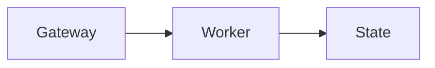

How the chat pane behaves: the session rail, the composer, and how the transcript renders.

## Session rail and side chat

While you watch a running session, the Gateway shows the model's latest safe preamble immediately as the session headline. When a utility model is available, it can replace that headline with a richer compact status digest after enough activity accumulates. Chat carries the result in a **session rail**: its compact pill shows the live digest, while the expanded rail shows the assessment, plan progress, pull requests, elapsed time, and a read-only Side chat thread. The rail can expand once when a run becomes stuck or needs input, and done or failed runs keep a frozen “finished” time based on the final digest. On wide chat panes the expanded rail docks as a 400 px right column; on narrower and mobile layouts it remains an overlay.

Side chat answers questions about the selected session and its project without entering or interrupting the main agent run. On the first question, the Gateway lazily loads a bounded visible snapshot of the selected session before starting the utility model. If history is temporarily unavailable, the question stays visible with **Retry** instead of being treated as an empty session. Side chat uses read-only access to the target session's history/search and agent workspace. Its bounded thread is held in Gateway memory, is restored when you switch sessions in the Control UI, and is cleared by the rail's trash button, a session reset or deletion, Gateway restart, or idle expiry. It never enters `chat.history`, and private reference context is not stored as operator dialogue. Open it with Shift-Command-S on Apple platforms or Ctrl-Shift-S elsewhere, or type `/btw <question>` or `/side <question>` in the main Control UI composer to open the rail and ask there; other clients keep their existing BTW behavior.

Highlighting text in a chat message offers **Ask in side chat**, which opens the rail with a quoted draft ready to edit.

The headline owns that run's sidebar subtitle instead of heuristic live activity. It is shared with the official iOS and Android session lists. A final done or failed digest remains visible while the session is unread, then the row returns to its normal work subtitle.

Session observation is enabled by default. Safe preamble headlines do not require a utility model; the utility model only owns richer assessments and terminal summaries. In **Settings > Appearance > Sidebar**, you can turn observation off gateway-wide, inspect the resolved small model and its provenance, or choose automatic routing, disable utility tasks, or select an explicit `agents.defaults.utilityModel`. The equivalent config controls are `gateway.controlUi.sessionObserver: false` and `agents.defaults.utilityModel: ""`.

## Session links in messages

Session links in messages open inside the Control UI. This includes `agent:` keys,
root-relative chat URLs, and URLs on the current origin or the Gateway's public origin
when its applied configuration is loaded. Hovering a link shows the session card
when the session is known locally. Unknown or ambiguous session references remain
navigable without a card; links to other origins keep normal browser behavior.
Document-relative hrefs are never session links; file references such as
`src/utils/foo.ts` retain workspace file handling.

## Composer capability menu

Select **+** beside the chat composer to open attachments and session capabilities in one menu:

- **Skills** enables or disables individual skills for this session.
- **Connectors** enables or disables configured MCP servers for this session. A **session** tag marks values that differ from the inherited configuration. **Browse connectors** opens the Plugins page on **Discover**.
- **Web search** enables or disables managed web search plus native OpenAI and Codex search for this session.
- **Manage plugins** opens the Plugins page.

These controls are sparse session overrides, like the model and thinking settings in the chat header. A capability with no override inherits the current agent or global configuration, and OpenClaw applies the resolved values when the next run materializes its tools and skills. The **N session overrides** pill in the composer footer reopens the menu; select its clear action to remove all capability overrides in one click.

In **Connectors**, administrators can select **Add MCP server…** and choose a scope. **This session** saves the server definition globally but disabled by default, then enables it only for the current session. **Everywhere** saves the definition enabled globally. Transport, authentication, and other server-definition fields are always global. Session policy can override server enablement and deny individual tools through **Tool access**.

**Tool access** lists a connector's tools once a run has discovered them. Before that, it explains why the list is empty rather than reporting zero tools: a newly added server has not connected yet, a connected server has not finished listing its tools, or the runtime catalog predates a config change. Sessions that run on the Codex harness keep their MCP connections inside Codex, so their tools do not appear here.

Capability toggles stay disabled until the Gateway, session, and runtime config are loaded, and read-only operators cannot change them. Adding a server requires administrator access. See [Connect MCP servers](/tools/mcp) for the Settings, CLI, and config paths.

## Chat behavior

Session dashboards and the Background tasks rail follow the selected conversation's agent, including when multiple agents each use a `global` session. Split panes keep their owners separate; panes showing the same agent and conversation share dashboard updates.

Automatic session titles describe the topic or intended task in your first message.
They are generated separately from the agent's work, so a title is not a completion
status or a report of tool access. Existing titles and manual names are left
unchanged; click a title to rename it.

Collapsed tool rows keep the tool label visible and truncate long summaries with an ellipsis. Tool and subagent activity rows use the same text size and weight. Running subagents show **Subagent** beside an animated indicator; terminal rows show **Subagent finished**, **Subagent failed**, or **Subagent cancelled**.

A turn that fails before producing any reply leaves a durable notice in the thread.

Chat error banners, including cloud runner failures, show short messages in full. Use **Copy error** beside **Details** in the header to copy the complete diagnostic received by the UI, even while collapsed. **Details** appears only when the complete diagnostic adds information beyond the preview, such as additional lines or text shortened for the preview; repeated lines and whitespace-only differences do not add details. Open it to read and select the complete diagnostic. The disclosure works with Enter or Space; the expanded text wraps long lines and can be scrolled with the keyboard. Copying does not open or close the details, and neither copying nor expanding an error retries the failed operation. Retry and other recovery actions remain separate from the disclosure.

<AccordionGroup>
  <Accordion title="Send and history semantics">
    - `chat.send` is **non-blocking**: it acknowledges admission with `{ runId, status: "started" }` and the response streams via `chat` events. An optional `messageSeq` identifies an already committed transcript position; it is omitted when input remains only in accepted custody. Trusted Control UI clients may also receive optional ACK timing metadata for local diagnostics.
    - Chat uploads accept images plus non-video files. Images keep the native image path; other files are stored as managed media and shown in history as attachment links. Before sending, use **Remove attachment** at the corner of a staged attachment; the control supports touch and keyboard input in both Chat and New Session.
    - Re-sending with the same `idempotencyKey` returns `{ status: "in_flight" }` while running, and `{ status: "ok" }` after completion.
    - `chat.history` responses are size-bounded for UI safety. When transcript entries are too large, Gateway may truncate long text fields, omit heavy metadata blocks, and replace oversized messages with a placeholder (`[chat.history omitted: message too large]`).
    - When a visible assistant message was truncated in `chat.history`, the Control UI automatically fetches the full display-normalized transcript entry through `chat.message.get` by `sessionKey`, active `agentId` when needed, and transcript `messageId`. The preview remains visible while the entry loads; recovered text replaces it inline.
    - Assistant/generated images are persisted as managed media references. New clients resolve their stable artifact ids through authenticated `artifacts.download` and receive short-lived, exact-resource media URLs, so reloads do not depend on raw base64 payloads or reusable credentials in image URLs. The chat uses bounded thumbnails and provides Open, Download, and Copy actions for the full image.
    - When rendering `chat.history`, the Control UI strips display-only inline directive tags from visible assistant text (for example `[[reply_to_*]]` and `[[audio_as_voice]]`), plain-text tool-call XML payloads (including `<tool_call>...</tool_call>`, `<function_call>...</function_call>`, `<tool_calls>...</tool_calls>`, `<function_calls>...</function_calls>`, and truncated tool-call blocks), and leaked ASCII/full-width model control tokens. It omits assistant entries whose whole visible text is only the exact silent token `NO_REPLY` / `no_reply` or the heartbeat acknowledgement token `HEARTBEAT_OK`.
    - During an active send and the final history refresh, the chat view keeps local optimistic user/assistant messages visible if `chat.history` briefly returns an older snapshot; the canonical transcript replaces those local messages once the Gateway history catches up. Pending sends in shared sessions remain a single bubble while incremental history catches up, even when another participant's reply arrives first. Saved commentary also replaces its matching live item when incremental history arrives after completion, cancellation, or failure, keeping the progress text in its original place.
    - Your pending prompt stays before its own saved assistant reply even when the reply arrives before history recovery finishes after reconnect; existing saved messages keep their transcript order.
    - Live `chat` events are delivery state, while `chat.history` is rebuilt from the durable session transcript. After tool-final events the Control UI reloads history and merges only a small optimistic tail; the transcript boundary is documented in [WebChat](/web/webchat). After an in-place `/clear` or `/reset`, fresh turns keep their user-before-reply order across live updates, incremental history catch-up, and reload.
    - `chat.inject` appends an assistant note to the session transcript and broadcasts a `chat` event for UI-only updates (no agent run, no channel delivery).
    - The sidebar lists every loaded active session by agent section and pinned/channel/work/custom/Chats buckets with a single New Session action that opens the draft dialog. Opening a visible row moves only the highlight. Sessions can be dropped onto Pinned to pin them, or onto a custom group or Chats to move them; custom groups are collapsible and drag-reorderable, group names and order sync through the gateway, and collapsed state stays in the browser. A new dashboard session asynchronously gets a concise generated title from its first non-command message; explicit names and authenticated sender identity remain separate, so account names are never used as generated titles. When New Session creates a worktree without an explicit worktree name, OpenClaw also uses the session label or generated title for its branch name, falling back to a readable crustacean-themed name. Set `agents.defaults.utilityModel` (or `agents.entries.*.utilityModel`) to route this separate model call to a lower-cost model; if that distinct model fails, title generation retries once with the primary model. Expanding another agent section browses that agent's sessions without leaving the open chat.
    - Thread search in the command palette (⌘K, or the search button in the top-left control cluster) follows a bounded number of matching pages across agents, searches active sessions, filters internal child/cron rows, and lists visible matches next to navigation commands. On the **Sessions** page at `/sessions`, the quick filter searches visible session metadata on the Gateway before pagination, including names, agent identity, model/runtime labels, run status, and goal text and usage. The selected agent (or **All agents**) and **Active / Archived / All** filters still apply. **Limit** sets the server page size (50 by default); **Load more sessions** appends the next matching page. Table sorting, grouping, overview counts, and **Rows per page** operate on the loaded rows, not a globally sorted result. **Search transcripts** searches message content separately and is not narrowed by the quick filter.
    - Each sidebar row keeps direct pin access plus a full context menu for unread state, rename, fork, grouping, archive, and delete. Cmd/Ctrl-click opens the session in a new browser tab. Multi-selected rows (Alt/Option-click, Shift-click for ranges) get a batch menu covering unread state, grouping, archive, and delete; batch Archive reports per-session failures while archiving eligible rows, whereas batch Delete keeps its separate idle-or-already-archived eligibility. Archive stays disabled for agent main sessions (including `global` in global scope) and the `unknown` sentinel. For any other session, including one with active work, the Gateway stops and fully drains that session's work before archiving it. The selected archived session stays open with an archived notice and **Unarchive** action; deleting the selected session switches Chat back to that agent's main session.
    - In the macOS app, the OpenClaw mark uses the otherwise-empty native titlebar strip next to the window controls instead of consuming a sidebar row.
    - On desktop widths, chat controls stay on one compact row and collapse while scrolling down the transcript; scrolling up, returning to the top, or reaching the bottom restores the controls.
    - The session header shows a small facepile beside the workspace chip when other people are viewing the same session; it lists up to four viewer avatars with an overflow count and disappears when you are alone. On multi-user gateways the header also carries the permanent session owner chip and a facepile of up to four participants who have prompted the session (owner excluded); sidebar rows compress the same information into a pair-stack — owner in front, one peeking participant or a +N count behind (see [Multi-user mode](/concepts/multi-user#reading-the-avatars)).
    - Consecutive duplicate text-only messages render as one bubble with a count badge. Messages that carry images, attachments, tool output, or canvas previews are left uncollapsed.
    - User-message bubbles carry transcript actions: a hover rewind button (confirm popover with a "Don't ask again" option) plus right-click **Rewind to here** and **Fork from here**. Rewind repoints the session to the state just before that message and returns its text to the composer for edit and resend (`sessions.rewind`, `operator.admin`). If you edit the composer while rewind is pending, your newer draft and attachments stay in place. Fork creates a new session from the active-path prefix before the message, opens it, and seeds its composer with the same text (`sessions.fork`, `operator.write`). Both actions disable with an explanatory tooltip while the agent is working, apply only to persisted user messages, and are rejected for sessions whose conversation is owned by an external agent harness. Rewind moves chat context only — files and other tool side effects are not reverted — and the pre-rewind transcript remains preserved in the append-only session store. When that store contains multiple transcript branches, the chat title bar shows a branch menu with each branch's latest message, message count, and recency; selecting an inactive branch switches the current session back to that preserved path (`sessions.branches.list`, `operator.read`; `sessions.branches.switch`, `operator.admin`). Branch switching is also unavailable while the agent is working, and selecting the already-active branch is a typed no-op error at the RPC boundary.
    - When a session's checkout sits on a non-default branch of a GitHub repository, the chat view pins pull request chips above the composer: PR number, repo, branch, diff counts, a CI pill, and draft/merged/closed state, each linking to the PR. The row shows at most two chips — live (open/draft) PRs first — and a "Show more" button reveals collapsed merged/closed history. The CI pill opens a small CI monitoring popover with passed/failed/running/skipped check counts and a link to the PR's checks page. Press Escape to close the active pane's CI popover. The Gateway polls only sessions visible in a connected Control UI and pushes changed snapshots through `controlUi.sessionPullRequests.changed`; it uses the explicit Control UI GitHub credential or the shared process-environment fallback for this read-only preview. When the GitHub API rate limit is hit, chips keep the last known status and show a warning that the status may be out of date; dismissing a chip hides it for that session in the current browser profile. Before any PR exists, the row shows the branch itself — repo, branch name, and the +/− size of the diff against the default-branch merge base (committed and uncommitted work). Open the compact account arrow beside **Publish PR** to inspect the publisher and account help. A single shared account is informational, with no redundant selector; multiple accounts can be chosen in the popover. **My GitHub** requires explicit selection even when it is the only available account; an agent override is labeled as an override, not System. The arrow appears only while publication is idle and account selection is unlocked, before a publication request or result. Pending status, retry actions, confirmation details, errors, and results stay inline. The Gateway-owned broker derives the repository and branch from session ownership, verifies the selected connection rather than using the preview credential, and returns the draft pull request URL or an actionable typed failure. Personal publication requires an idle, reconciled workspace and current write access to the session. Repository-only sessions publish an accepted Git-normalized checkpoint while their worker is idle or after Stop, without creating a Gateway checkout. Remote sessions sourced from a Gateway worktree still require **Stop cloud worker…** first. It never follows another participant's later turn or falls back to another account; unfinished personal publication needs same-owner confirmation after a Gateway restart. See [Publish with your account](/concepts/user-model#publish-with-your-account). The row hides itself while an open or draft PR exists; for Gateway-source checkouts, once the branch's PR is merged and the pushed tip still matches the merged head, the row disappears too. The branch row comes from local Git or the repository session's recorded URL and branch, so it stays available while GitHub is rate limited and carries the same stale-status warning, since "no PR found" cannot be trusted until the limit resets.
    - The session diff panel shows what a session's checkout actually changed: the branch button in the workspace rail or chat title bar opens a dense per-file viewer with normalized added/deleted/modified counts, collapsible files, wrapping and unified/split layouts with source syntax highlighting, file copy/open/editor actions, and "N unmodified lines" markers between hunks. The footer switches between all changes, uncommitted work, and individual commits while showing how far the branch is ahead of its merge base; committed branches also provide a copyable local sync command. Diffs are computed server-side through the `sessions.diff` Gateway method (`operator.read` scope); binary and oversized files degrade to stats-only entries, and the button only appears when the connected Gateway advertises `sessions.diff`.
    - Every Chat pane has a title bar. Click the session title to rename it; the workspace chip copies the checkout path or branch and can reveal local Gateway workspaces in the host file manager. Remote and exec-node sessions keep copy actions but hide reveal.
    - The **Files** tab in each Chat pane's unified side panel lists thread files, project files, and artifacts. For an active repository-only session it reads the node checkout. After Stop it exposes retained changed-file previews; unchanged upstream files, editing, and full diffs require the worker to run again. The stopped diff panel explains this limitation. Reopen it with ⇧⌘B, the files toggle in the title bar, or the panel's **+** menu; the title-bar toggle carries a changed-file count badge.
    - File paths recognized in chat messages read as their basename with a small glyph for the file type in front — a Markdown page, a `package.json` manifest, a TypeScript source, a `.tsx` component, a config or data file, a shell script, and an image each get their own mark, and anything else falls back to a plain document. When two links in the same message share a basename, each keeps just enough of its trailing path to stay distinct. The full path stays on the link: it is what the tooltip shows, what opens in the file panel, and what the message's **Copy** action returns, since copy hands back the original Markdown. Labels you write yourself in a `[label](path)` link are never rewritten. The glyph is drawn from the bundled icon set, never fetched from the network, and is decorative only: it is not read by screen readers and is not part of copied text. Text that is not a recognizable path — anything carrying spaces, parentheses, a `#` fragment, or a `?` query — stays plain prose.
    - Clicking a file reference in chat, a file path in an expanded read/edit/write tool card, or a file row in **Files** opens the **Review** tab. UTF-8 text files use a CodeMirror-based code view with syntax highlighting, line numbers, jump-to-line, in-file search, copy actions, and an open-in-external-editor menu. AVIF, GIF, JPEG, PNG, and WebP images no larger than 256 KiB render inline; other binary files show metadata without lossy text decoding. When the Gateway advertises `sessions.files.set` to an `operator.admin` connection, the text panel adds an Edit mode with dirty tracking and Cmd/Ctrl-S save; unsaved drafts survive file, panel, and session navigation in the current browser tab until explicitly saved or discarded. Saves are compare-and-swap on a content hash returned by `sessions.files.get`: if the file changed on disk since it was loaded (for example because the agent kept working), the panel shows a conflict notice with Reload (take the latest content) and Overwrite (keep the local edit) actions. Writes go through the same fs-safe workspace guards as reads — path containment, symlink/hardlink rejection, and a 256 KiB UTF-8 cap — and only overwrite existing files; the editor never creates or deletes them. If the editor cannot load, use **Retry** or **View Raw Text**. A missing editor chunk after an update offers **Reload**, which waits for the Gateway to become reachable.
    - Subagent sessions opened in the main chat view are view-only. The composer identifies the parent session and offers **Open parent session** so you can continue the conversation there. Message input, reply actions, model and access pickers, microphone, and attachment controls are hidden. This does not change copy or fork availability; **Open parent session** takes you to the conversation where you can reply. **Stop** remains available when the Gateway reports an abortable run.
    - The **Tasks** tab lists the current agent's background tasks and subagents (`tasks.list` scoped by agent, kept live by `task` events): running work shows a live elapsed timer, tool-use count, the tool currently in use, and a stop control, while the collapsible finished section adds run durations. Inline subagent activity rows show status and progress without per-task edit counters. **Review** retains each task’s cumulative edit-activity counter; the checkout chip above the composer shows the session checkout’s actual Git diff. Selecting a task from either a task row or an inline subagent activity row opens its live status and transcript in **Review** without replacing the main conversation; tasks whose session is the current conversation show their prompt and output inspector there instead. Open **Tasks** with the title-bar activity toggle or the panel's **+** menu; the task snapshot loads eagerly, so the title-bar toggle carries a running-count badge without opening the tab first. The Tasks page remains the full cross-agent ledger.
    - Each task has a main view and a unified side panel. The task toolbar's **Swap** button exchanges the main view and active side-panel tab; its tooltip names both views, for example **Swap Chat and Dashboard**. Chat, Dashboard, Browser, Terminal, Files, and Review can all be main. Other side-panel tabs remain available. **Focus** in the main pane header gives that view the full task area; **Restore split** brings the side panel back. Swapping or focusing preserves live content and drafts. Closing the whole side panel hides it without changing the main view, and the browser remembers each task's arrangement.
    - The task toolbar's **Layout** menu positions the side panel left, right, or below the main area. It adapts to each pane's own width rather than the window, falls back to a bottom strip in a narrow pane or compact window, and hides its dock controls until the pane widens. Phone-sized viewports still open review content full-screen.
    - The chat header model and thinking pickers patch the active session immediately through `sessions.patch`; they are persistent session overrides, not one-turn-only send options.
    - Diff syntax highlighting uses each file's language and the current theme; unknown file types and oversized previews remain plain text. Inline and session diffs do not require the optional [Diffs plugin](/tools/diffs), which creates standalone viewer links and PNG/PDF attachments.
    - **Split view:** open it from the chat title bar (beside the thread diff, background tasks, and thread files toggles), then split the active pane right or down for as many panes as fit. Each pane has its own thread, transcript, composer, and tool stream.
    - Agents with the `screen` tool can request the same pane, sidebar, terminal, browser, focus, and navigation changes while a capable Control UI is connected. Protocol v1 applies the command to every connected capable Control UI; see [Screen](/tools/screen).
    - Drag a session from the sidebar into chat to open it in a pane. An animated drop preview glides between zones and labels the outcome — "Split" over the exact half a new pane will occupy, "Open here" over a whole pane — and drops also work from single-pane mode.
    - The active split pane drives the sidebar selection and URL. Its title bar adds split and close controls; dividers resize columns and stacked panes, and the browser stores the layout locally across reloads.
    - On narrow screens, split view keeps the layout but renders only the active pane, including its header with the close control.
    - If you send a message while a model picker change for the same session is still saving, the composer waits for that session patch before calling `chat.send` so the send uses the selected model.
    - On the New Session page, press **Cmd+Enter** on macOS or **Ctrl+Enter** elsewhere to create and start the draft in a background session without leaving the page. The selected local, cloud-profile, or paired-device placement is preserved. With the **Modifier+Enter** send preference, use **Cmd/Ctrl+Shift+Enter** for background start; Cmd/Ctrl+Enter remains ordinary submit. Explicit Draft visibility keeps its create-only behavior. A completion notice offers to open the new session.
    - Typing `/new` creates and switches to the same fresh dashboard session as New Chat, except when `session.dmScope: "main"` is configured and the current parent is the agent's main session; then it resets the main session in place. Typing `/reset` keeps the Gateway's explicit in-place reset for the current session.
    - The chat model picker requests the Gateway's configured model view. If `agents.defaults.modelPolicy.allow` is non-empty, that policy drives the picker, including `provider/*` entries that keep provider-scoped catalogs dynamic. Otherwise the picker shows configured entries plus providers with usable auth; aliases and settings under `agents.defaults.models` do not restrict it. The full catalog stays available through the debug `models.list` RPC with `view: "all"`.
    - **Account for this chat** in the model menu lets an identified person choose a saved account for the selected provider in Chat or **New Session**, even when **Automatic** has no eligible models. A New Session choice previews eligible models and is attached when the session is created; it does not change the personal new-chat default or saved model preference. See [Per-person model accounts](/concepts/multi-user#per-person-model-accounts).
    - Chat and New Session block sending when the Gateway reports missing provider credentials or a confirmed authentication failure. Missing credentials point to **Model Setup**; authentication failures ask you to review the credential or sign-in. An explicit account choice in New Session also waits for a successful preview confirming that account and an eligible model; pending or failed previews show why Start is blocked. Otherwise, temporary credential cooldowns and unknown model availability do not block sending or show an authentication banner; run errors remain visible in the transcript. Unavailable model choices stay disabled in the picker.
    - After a config change or a published credential update, connected Chat and New Session views re-read model readiness automatically; no page reload or picker action is needed. Chat also re-reads its session projection after a model or auth-profile selection changes. An existing missing-credential or authentication-failure block stays in place while that read is pending or fails, until replacement metadata changes it. Existing chats keep their session's selected auth profile; New Session readiness reflects its draft account choice when one is set. This refresh is event-driven, not a timed polling guarantee.
    - The chat composer usage ring follows the selected session and agent, including global sessions. Open it for the current context window, latest-run token counts, and the current provider's account, plan, and quota when reported. Subscription quota replaces dollar estimates; other sessions can show estimated total cost and the latest provider response's input/output/cache cost breakdown. Fresh usage switches to warning styling at high context pressure; stale token snapshots remain visible as approximate usage without that warning. During an agent switch, the previous agent's session row is not reused for the ring.

  </Accordion>
  <Accordion title="Talk mode (browser realtime)">
    Talk mode uses a registered realtime voice provider. Configure OpenAI with `talk.realtime.provider: "openai"`. GA `gpt-realtime-*` browser WebRTC uses Platform auth in this order: `talk.realtime.providers.openai.apiKey`, an `openai` API-key profile, then `OPENAI_API_KEY`. Native GPT-Live browser WebRTC and Gateway relay prefer a ChatGPT OAuth subscription profile and create calls through the Codex backend offer route; Platform API-key calls use `api.openai.com/v1/live` and require access to that API. Both keep the authenticated GPT-Live sideband on the Gateway. Gateway relay also keeps the WebRTC media peer server-side. GPT-Live has its own voice choices, shown by the model-aware Talk picker; GA Realtime voices do not apply. See [Talk mode](/nodes/talk) for setup and transport details. Configure Google with `talk.realtime.provider: "google"` plus `talk.realtime.providers.google.apiKey`. The browser never receives a standard provider API key or a ChatGPT OAuth token: Platform GA OpenAI receives an ephemeral Realtime client secret, native GPT-Live WebRTC receives a one-use Gateway reservation, and Google Live receives a one-use constrained Live API auth token for a browser WebSocket session. Gateway relay keeps provider credentials and vendor sockets server-side while browser audio moves through authenticated Gateway RPCs. Platform GA sessions use the Gateway's direct-tool prompt, while GPT-Live uses provider delegations. `talk.client.create` does not accept caller-provided instruction overrides.

    Persistent provider, model, voice, transport, reasoning effort, exact VAD threshold, silence duration, and prefix padding defaults live in **Settings → Communications → Talk**; changing them requires `operator.admin` access. Configuring Gateway relay forces the backend relay path; configuring WebRTC keeps the session client-owned and fails instead of silently falling back to relay if the provider cannot create a browser session.

    The Talk control itself is the microphone button in the composer toolbar. Its caret lists **System default** and every microphone exposed by the browser, including USB, Bluetooth, and virtual inputs. The selected device ID stays browser-local and is never sent to the Gateway; if that exact device disappears or the browser cannot open it, Talk asks you to choose another input instead of silently recording from a different microphone.

    For a selected-microphone constraint failure, click **Use System default for this call** to explicitly retry with the system default. This does not change your saved microphone preference. Until you click, no different microphone opens and no provider session is allocated. Dismissing the error, leaving the chat, disconnecting, or starting another call cancels that recovery action. For dictation, choose another input or **System default** from the existing microphone picker, then start again; dictation never switches microphones automatically.

    While Talk is live, the microphone button becomes a pill showing the live input-level meter; clicking it stops voice input, and hovering it reveals the stop glyph. Screen readers announce `Connecting voice input...`, `Listening...`, or `Asking OpenClaw...` while a realtime tool call is consulting the configured larger model through `talk.client.toolCall`. Stopping a running agent response stays a separate square **Stop** control next to the pill.

    **Video Talk** is available for OpenAI Platform Realtime WebRTC and Google Live browser sessions; GPT-Live is audio-only. Click the camera button, allow camera and microphone access, and confirm the local preview. OpenAI sends one bounded JPEG frame over its browser data channel when `describe_view` requests visual context. Google Live sends bounded JPEG frames directly from the browser to the provider at the supported maximum of one frame per second and answers `describe_view` function calls with the camera-stream state. Camera frames never pass through the Gateway. Stopping Talk closes the preview and releases both media tracks. See Google's [Live API capabilities](https://ai.google.dev/gemini-api/docs/live-api/capabilities#video) and [function-calling guide](https://ai.google.dev/gemini-api/docs/live-api/tools) for the provider wire contracts.

    Maintainer live smoke: `OPENAI_API_KEY=... GEMINI_API_KEY=... node --import tsx scripts/dev/realtime-talk-live-smoke.ts` verifies the OpenAI backend WebSocket bridge, a synthesized PCM24 speech-to-response audio roundtrip, OpenAI browser WebRTC SDP exchange, Google Live constrained-token browser setup with a JPEG frame and `describe_view` function roundtrip, and the Gateway relay browser adapter with fake microphone media. Pass `--openai-audio-cycles 3` for a short repeated OpenAI connect, talkback, and close soak. The command prints provider status only and does not log secrets.

  </Accordion>
  <Accordion title="Stop and abort">
    - Click **Stop**. Runs with an exact local run ID call `chat.abort`; when selected-session state reports active work but the Control UI has no local run ID, it calls `sessions.abort` instead. For non-global sessions, that selected-session path also discards queued follow-ups so they cannot restart work after the stop.
    - Exact-run Stop cancels that parent's associated sub-agents and Swarm collectors, including their descendants. Successful cancellation prevents selected queued children from starting while running siblings stop; it leaves unrelated parent turns and session-wide queues alone.
    - If Stop reports incomplete descendant cancellation, inspect **Tasks** and retry cancellation for the remaining children. Do not treat the parent's stopped state as confirmation that every child stopped or that runtime cleanup was instantaneous. See [Sub-agent stopping](/tools/subagents#stopping) for scope details.
    - While a run is active, normal follow-ups use the Gateway's effective `messages.queue` mode. `steer` injects into the running turn; other modes keep the browser's durable queued delivery. Steering rejection also falls back to that queue. Once the Gateway accepts input for an existing session, its database owns the approved input until it reaches the transcript. Collected messages are retired together with their combined transcript entry. Unconsumed input survives a Gateway restart as interrupted input requiring an explicit resend. Click **Steer** on a queued message to inject it manually. Text already streamed in an open chat stays before the steering message across history refreshes and reconnects; subsequent updates show only the continuation below it.
    - With **Settings → Appearance → Send shortcut** set to **Enter**, **Cmd/Ctrl+Enter** submits the opposite follow-up action while connected to an active run: queue when Enter steers, or steer when Enter queues (including inherited `collect` and `followup` modes). The send button tooltip shows both actions for the current follow-up setting. This affects only that message, not your saved preference. With the **Cmd/Ctrl+Enter** send shortcut selected, modified Enter remains the normal send action and plain Enter inserts a newline. Interrupt mode keeps its normal behavior.
    - Reorder the queue from the handle on the left of a queued message: drag it, or focus it and press the up and down arrow keys. The position is stored with the message, so it survives a reload and decides delivery order, not just what the list looks like. Rows already handed to a run — sending, steering, running a command, awaiting settings, or waiting on an uncertain delivery — hold their place and split the queue: a message moves only among the rows between two of them, so it can never reach the Gateway ahead of work already handed over.
    - Edit a queued message with the pencil on its row, or by double-clicking the row. The row becomes its own textarea and stays in place while the main composer remains independent, including any separate draft and attachments. Submit replaces the row in the same slot and preserves its attachments; Cancel or Escape discards the row-local draft and restores the queued message. A normal composer send remains a separate queued item even while a row edit is open. The queue behind an edited row waits rather than delivering a message you are still rewriting, so that row splits the queue for reordering the same way an in-flight row does. Queued slash commands keep the discard-and-retype flow.
    - **Settings → Appearance → Chat → Follow-ups while the agent is working** can override that server default for the current browser. The page marks an override explicitly and offers **Reset to server default**. `Steer into the active run` sends follow-ups immediately, while `Queue until the run ends` holds them until the run finishes.
    - Type `/stop` (or standalone abort phrases like `stop`, `stop action`, `stop run`, `stop openclaw`, `please stop`) to abort out-of-band.
    - `chat.abort` supports `{ sessionKey }` (no `runId`) to abort authorized active runs for that session without cascading to children. The Control UI uses the broader `sessions.abort` path when it has no local run ID.

  </Accordion>
  <Accordion title="Abort partial retention">
    - When a run is aborted, partial assistant text can still be shown in the UI.
    - Gateway persists aborted partial assistant text into transcript history when buffered output exists.
    - Persisted entries include abort metadata so transcript consumers can tell abort partials from normal completion output.

  </Accordion>
</AccordionGroup>

### Source previews and copying code

**View Raw Text** keeps Markdown notation literal, including nested code fences.
Decoded text artifacts use the same literal preview. **Copy code** preserves the
code's leading whitespace and final newline when present.

### Markdown tables

Markdown tables scroll horizontally within the conversation. **Copy table** copies
tab-separated cells, and **Expand table** opens a larger view. In Chat, workspace
file and session links work in either view, including Enter and Space keyboard
activation. Following a link closes the expanded view so you can use its destination.

The **Ask OpenClaw** panel supports table scrolling, copying, expansion, and web
links. Its session links open with a click or Enter. Space does not activate
those links, and workspace-file references do not open a preview.

### Mermaid diagrams

Use a `mermaid` fenced code block in chat. The Control UI renders it as a diagram
automatically:

````markdown

````

Open the **Diagram options** menu in the top-right corner to switch between the
diagram and source or choose **Expand diagram** for the image viewer with zoom.
The copy button appears on hover or keyboard focus and stays visible on touch
screens. It copies the original Mermaid text.
Diagram colors and fonts follow the current UI theme.

An unfinished streaming fence stays readable as code. Rendering starts when the
closing fence arrives or the response finishes. Invalid or overly complex
diagrams keep their source visible with an error; correct the syntax or simplify
the diagram. Diagram source cannot run scripts or click handlers, load external
images, or add custom CSS to the Control UI.

Renderer loading or timeout errors instead suggest reloading the dashboard and
checking proxy authentication. The renderer runs in an isolated frame, so its
`assets/mermaid.min-*.js` and `assets/frame-*.js` requests do not send `SameSite=Lax`
or `SameSite=Strict` cookies. Behind a cookie-authenticated reverse proxy, those
static asset URLs must be reachable without those cookies, including under any
configured `gateway.controlUi.basePath`. Check the browser Network panel for
blocked requests or redirects to a login page. Keep authentication on the
dashboard and Gateway APIs; any proxy exception should cover only these static
renderer assets. Reload after correcting the asset access rules.

## Hosted embeds

Assistant messages can render hosted web content inline with the `[embed ...]` shortcode. The iframe sandbox policy is controlled by `gateway.controlUi.embedSandbox`:

Widgets created by `show_widget` load through the authenticated Gateway connection in every sandbox mode, including while settings are loading. In `strict` mode, their content remains visible but scripted interactions are disabled.

The core [`show_widget`](/tools/show-widget) tool renders self-contained SVG or HTML directly from a tool call. The browser and supported native chat clients advertise the `inline-widgets` Gateway capability, and the resulting Canvas document remains available when chat history reloads. Channel plugins such as Discord Activities can register contextual presenters behind that same tool. Channel-originated runs without an eligible presenter or inline client do not receive it.

<Tabs>
  <Tab title="strict">
    Disables script execution inside hosted embeds.
  </Tab>
  <Tab title="scripts (default)">
    Allows interactive embeds while keeping origin isolation; usually enough for self-contained browser games/widgets.
  </Tab>
  <Tab title="trusted">
    Adds `allow-same-origin` on top of `allow-scripts` for same-site documents that intentionally need stronger privileges.
  </Tab>
</Tabs>

```json5
{
  gateway: {
    controlUi: {
      embedSandbox: "scripts",
    },
  },
}
```

<Warning>
Use `trusted` only when the embedded document genuinely needs same-origin behavior. For most agent-generated games and interactive canvases, `scripts` is the safer choice.
</Warning>

Absolute external `http(s)` embed URLs stay blocked by default. To let `[embed url="https://..."]` load third-party pages, set `gateway.controlUi.allowExternalEmbedUrls: true`.

## Chat transcript layout

The chat transcript uses a centered readable frame aligned with the composer. Assistant and tool output stay left-aligned while your own messages stay right-aligned inside that frame. In multi-user sessions (for example a group chat relayed from a channel plugin), messages from other attributed participants render left-aligned with the author's avatar, name, and a stable per-identity color, so only the signed-in viewer's messages read as "mine". When two or more attributed participants are present, assistant replies carry a small "Replying to name" marker naming the participant whose message triggered the turn. System entries such as local slash-command output render as centered notice rows without an avatar.

Images in your own messages appear above any accompanying text, without a surrounding bubble background. Hovering an image leaves that layout unchanged, and the text keeps its normal bubble color, including any per-identity tint.

Messages forwarded by `sessions_send` render as left-aligned speech bubbles with a source-session chip above the message. When avatars are shown, messages from a different known agent use that agent's avatar, or initials in a stable identity color if no avatar is available. Same-agent forwards and unknown senders keep the forward icon. Select the chip to open the source session; hover it to see session progress. Each source session has a stable bubble tint. Forwarded messages without a known source session show the source agent when available, or a generic forwarded-message label. The receiving agent's own replies remain flat text.

## Chat message width

Drag the side-panel divider to resize a task's **Review** transcript. Messages
and expanded tool input reflow within the panel, keeping tool-card borders visible.

Wide-monitor users can override the transcript width under **Settings → Chat →
Message width**. The preference stays in that browser's local storage. Supported
forms include plain lengths and percentages such as `960px` or `82%`, plus
constrained `min(...)`, `max(...)`, `clamp(...)`, `calc(...)`, and
`fit-content(...)` width expressions.
